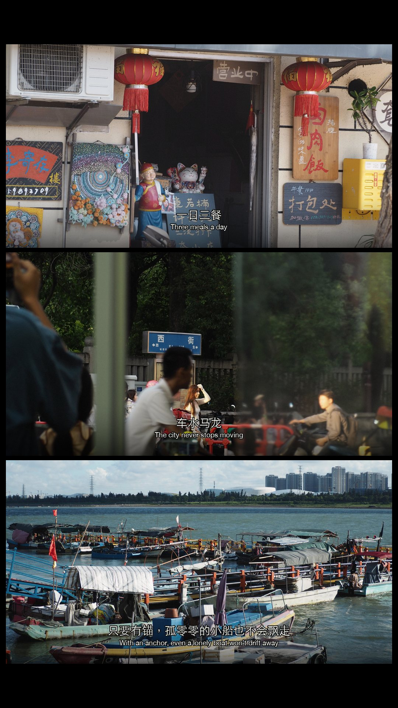

# Fuji Cinematic Collage Skill

一个用于生成或整理富士胶片启发型电影静帧、9:16旅行三联画、接触印样和中英双语字幕的 Codex Skill。



## 主要能力

- 使用现有照片制作电影感双联、三联、四格和接触印样
- 默认 9:16 黑色画布和 1.9:1 旅行电影帧
- 每格独立的中文＋英文电影字幕
- `soft-eterna`、`documentary-chrome`、`warm-negative` 等原创胶片色彩方向
- 确定性裁切、调色、细颗粒、字幕和尺寸验证脚本
- 支持根据故事生成连续电影静帧后再拼接

## 安装

### 使用 Codex Skill Installer

让 Codex 从下面的仓库路径安装：

```text
https://github.com/imlt1005-dev/generate-fuji-cinematic-frame/tree/main/generate-fuji-cinematic-frame
```

### 手动安装

```bash
git clone https://github.com/imlt1005-dev/generate-fuji-cinematic-frame.git
cp -R generate-fuji-cinematic-frame/generate-fuji-cinematic-frame ~/.codex/skills/
```

重新打开 Codex 任务后即可使用 `$generate-fuji-cinematic-frame`。

## 使用示例

```text
用 $generate-fuji-cinematic-frame 把这些旅行照片做成9:16三联电影拼图，
采用柔和低反差胶片色彩，每格添加独立中英字幕。
```

```text
用 $generate-fuji-cinematic-frame 根据“雨后的老城区”生成三格电影分镜：
第一格交代街道，第二格拍人物经过小店，第三格留下湿地倒影。
```

## 本地脚本依赖

拼图和字幕脚本需要 Python、Pillow 和 NumPy：

```bash
python -m pip install pillow numpy
```

Codex Desktop 的捆绑工作区 Python 通常已经包含这些依赖。

## 仓库结构

```text
generate-fuji-cinematic-frame/
├── SKILL.md
├── agents/openai.yaml
├── references/
└── scripts/
```

## 许可

Skill 的代码和文字说明采用 MIT License。示例照片及其合成图不包含在 MIT License 中，具体规则见 [ASSET-LICENSE.md](ASSET-LICENSE.md)。

“Fuji”在本项目中仅用于描述受胶片色彩启发的视觉方向；本项目不宣称精确复刻任何专有胶片模拟，也与 Fujifilm 无隶属或认可关系。
